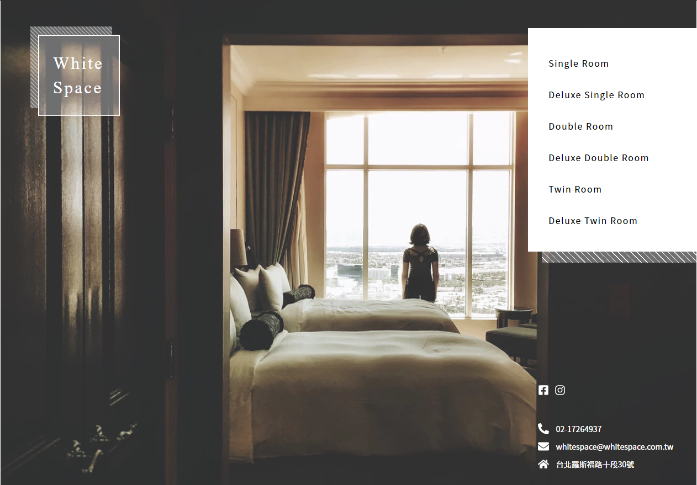

# THE F2E 2nd : 旅館預約服務

## DEMO

[Demo](https://g6165310.github.io/90sGame/)

## API 說明

- 取得所有房型 [GET] https://challenge.thef2e.com/api/thef2e2019/stage6/rooms
- 取得單一房型細節 [GET] https://challenge.thef2e.com/api/thef2e2019/stage6/room/{id}

  \* {id} 帶入房間 id

- 預約房型 [POST] https://challenge.thef2e.com/api/thef2e2019/stage6/room/{id}

  (以上請求都需額外帶入相關 Header 資訊，細節[請看](https://challenge.thef2e.com/news/17))

## 攻略心得

### 使用 Vue + Vue Cli 3 + Vuex

1.  SCSS 相關設定

    由於我需要使用自己建立的 mixin，且必須讓全域都可以使用，因此需要在設定上做一些調整。

        //建立一個 vue.config.js
        module.exports = {
          css: {
            loaderOptions: {
              scss: {
                data: `@import "@/scss/all.scss";`
              }
            }
          }
        };

2)  [Moment.js](https://momentjs.com/) + [vuejs-datepicker](https://www.npmjs.com/package/vuejs-datepicker)

    本次比較麻煩的部分就是日曆以及時間處理等問題，這部分使用 Moment.js 來處理時間，以及 vuejs-datepicker 來呈現日期的 input。

    - Moment

          // 取得目前日期
          moment().format("YYYY-MM-DD")

          // 取得當月天數
          moment().daysInMonth()

          // 日期的加減操作
          moment().add(1,'months')
          moment().subtract(1,'months')

          // 比較日期(這邊舉例 include same date)
          moment().isSameOrBefore(特定日期)
          moment().isSameOrAfter(特定日期)

          // 是否在特定區間
          moment().isBetween(時間1,時間2)
          預設為兩端不包含，可以透過最後一個參數做調整

    - vuejs-datepicker

      之所以選擇這個套件的原因是原本預設的 input 比較不好看 <input type=date>

      所以才找一個包裝過比較好看且有一些額外功能的套件使用。

          // 可傳入 props 對 datePicker 進行資料或是外觀的調整
          <DatePicker
            format="yyyy/M/dd"  //顯示在 input上的格式
            v-model="日期"  //v-model 綁定資料
          />

          // 綁定特定行為事件
          <DatePicker
            @input='callback'
          />

          // 綁定特定日期為不可選擇
          <DatePicker
            :disabled-dates="{
              to: 日期,  // 日期之前為 disable
              from: 日期,  //日期之後為 disable
              dates: [日期,日期] //可直接給一組需 disable 的日期
            }"
          />

3.  新知識點 (provide , inject) [文件](https://cn.vuejs.org/v2/api/?#provide-inject)

    由於 vue router 沒辦法 reload 當前的頁面，為了解決這個問題，看到有人使用 provide/inject + v-if 的方式來讓 router-view 進行 rerender。

    父組件可以透過 provide 提供資料，讓其子組件可以利用 inject 來取得，且不論子組件的深度。

        // App.vue
        //除
        provide() {
          return {
            reload: this.reload
          };
        }

        //Modal.vue
        inject: ["reload"]
        
## 待優化

  1. RWD
  
  2. 日曆產生計算方式

## 美術來源

- [edith.hsu](https://challenge.thef2e.com/user/1600?schedule=3851#works-3851)
